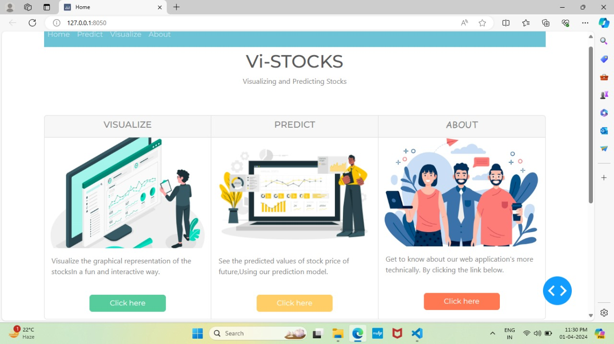
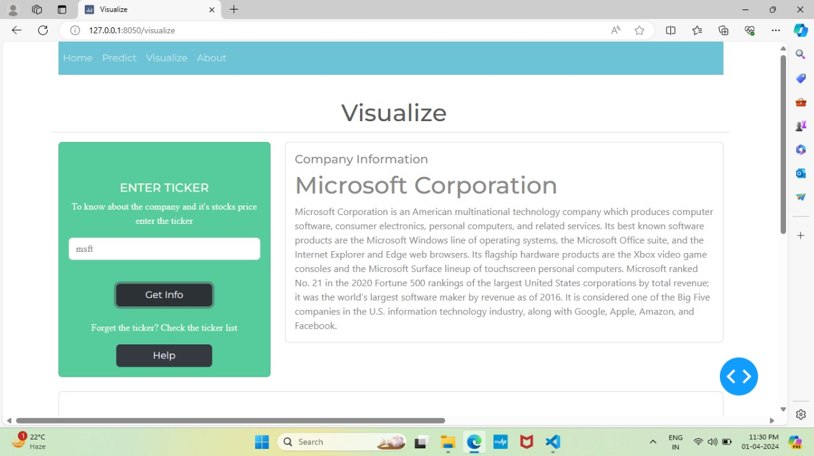
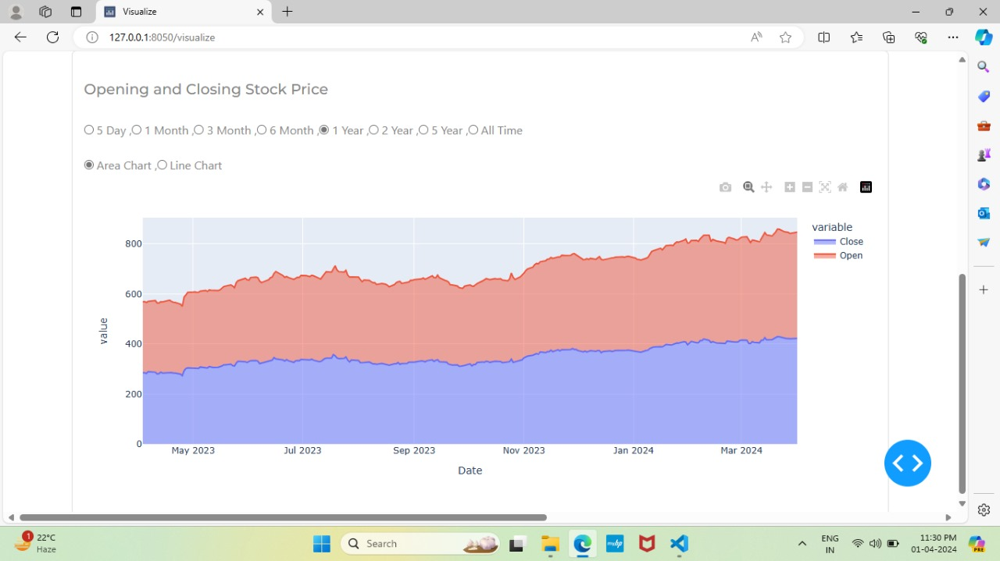

# ViStocks

ViStocks is a stock analysis and prediction tool that allows users to view historical stock data and predict future stock prices. The application provides an interactive dashboard for visualizing stock information and predicting closing prices using Support Vector Regression (SVR).

## Features

1. **Stock Data Visualization**:
    - Enter the ticker of any company to view its stock information.
    - Display the company name, description, and stock graphs.
    - View opening and closing price graphs.
    - Change the graph duration.
    - Switch between line and area graphs.

2. **Stock Price Prediction**:
    - Predict the closing prices of any company by entering the ticker and the number of days for prediction.
    - Display predicted values in an area graph.

## Technology Stack

- **Front-end**: Dash
- **Back-end**: Python
- **Prediction Model**: Support Vector Regression (SVR)
- **Data Source**: Yahoo Finance API 

## Installation

1. Clone the repository:
    \`\`\`bash
    git clone [https://github.com/your-username/ViStocks.git](https://github.com/ShushantSharma372/Vistocks.git)
    cd ViStocks
    \`\`\`

2. Create and activate a virtual environment (optional but recommended):
    \`\`\`bash
    python3 -m venv venv
    source venv/bin/activate   # On Windows, use `venv\Scripts\activate`
    \`\`\`

3. Install the required dependencies:
    \`\`\`bash
    pip install -r requirements.txt
    \`\`\`

## Usage

1. Run the Dash application:
    \`\`\`bash
    python app.py
    \`\`\`

2. Open your web browser and navigate to \`http://127.0.0.1:8050/\`.

3. Enter the ticker symbol of the company you want to analyze.

4. View the stock data and adjust the graph settings as desired.

5. For stock price prediction, enter the ticker symbol and the number of days for prediction, then view the predicted values in the graph.

## Screenshots

### Home Page

### Stock Price Visualization

## Contributing

Contributions are welcome! Please fork the repository and create a pull request with your changes. Ensure that your code follows the project's coding standards and includes relevant tests

## Acknowledgments

- [Dash](https://dash.plotly.com/)
- [Yahoo Finance API](https://www.yahoofinanceapi.com/)
